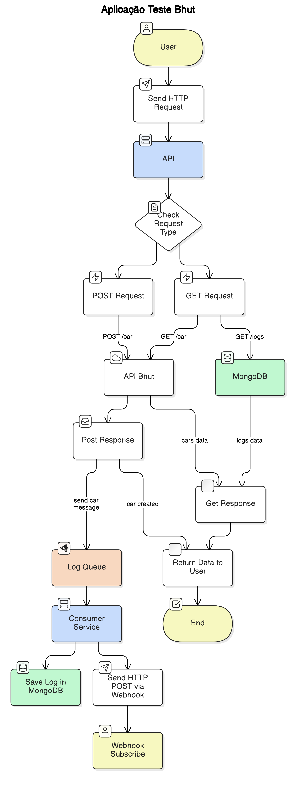

# Projeto de Teste para Bhut

O sistema é composto por dois serviços, um banco MongoDB e uma mensageria RabbitMQ. 


## Executando o projeto

Para fazer o deploy, crie um arquivo `.env` copiando ou renomeando `example.env` presente na raiz do projeto.

```bash
API_BHUT_URL= #url da API BHUT para enviar as requisições
API_BHUT_USERNAME= # o username cadastrado na API BHUT  
API_BHUT_PASSWORD= # o password cadastrado na API BHUT  
WEBHOOK_URL= # um endopoint que receberá as requisições POST disparadas pela API
```

Para visualizar o recebimento dos webhooks de forma simples e prática, sugiro utilzar as ferramentas [Webhook Cool](https://webhook.cool/) ou [Webhook Tester](https://webhook-test.com/)

Com as váriaveis devidamente inicie os serviços utilizando o Docker Compose:
```bash
docker compose up -d
```

## Documentação da API

#### Retorna uma lista de carros

```http
  GET /api/car?ativo=true&pagina=1&tamanhoPagina=10
```

| Query   | Tipo       | Descrição                           |
| :---------- | :--------- | :---------------------------------- |
| `ativo` | `boolean` | **Opcional**. Busca os dados cadastrados como ativo |
| `pagina` | `number` | **Opcional**. Busca uma página específica. |
| `tamanhoPagina` | `number` | **Opcional**. A quantidade de itens retornado por página de busca. |

#### Retorna salva um novo carro

```http
  POST /api/car
```

| Parâmetro   | Tipo       | Descrição                                   |
| :---------- | :--------- | :------------------------------------------ |
| `nome`      | `string` | **Obrigatório**. O nome do carro |
| `marca`      | `string` | **Obrigatório**. O nome da marca do carro |
| `preco`      | `number` | **Obrigatório**. O preço do carro. Pode ser decimal. |
| `anoFabricacao`      | `number` | **Obrigatório**. O ano de fabricação do carro. |

#### Retorna uma lista de logs

```http
  get /api/logs
```

## Diagrama

Diagrama do projeto



